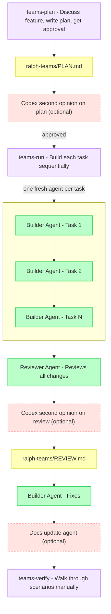

# Execution Flow

```mermaid
flowchart TD
    classDef user fill:#ffdfba,stroke:#ffb347,stroke-width:2px,color:#333
    classDef orch fill:#bae1ff,stroke:#5facff,stroke-width:2px,color:#333
    classDef agent fill:#baffc9,stroke:#42d669,stroke-width:2px,color:#333
    classDef doc fill:#ffffba,stroke:#e6e65a,stroke-width:2px,color:#333
    classDef cmd fill:#f3e8ff,stroke:#c084fc,stroke-width:2px,color:#333
    classDef optional fill:#ffe4e1,stroke:#ff9999,stroke-width:1px,stroke-dasharray:4,color:#333

    P1["teams-plan - Discuss feature, write plan, get approval"]:::cmd
    P["ralph-teams/PLAN.md"]:::doc
    CX1["Codex second opinion on plan (optional)"]:::optional

    P1 --> P
    P --> CX1

    P2["teams-run - Build each task sequentially"]:::cmd

    CX1 -->|"approved"| P2

    subgraph Build[" "]
        direction TB
        B1["Builder Agent - Task 1"]:::agent
        B2["Builder Agent - Task 2"]:::agent
        BN["Builder Agent - Task N"]:::agent
        B1 --> B2 --> BN
    end

    P2 -->|"one fresh agent per task"| Build

    R["Reviewer Agent - Reviews all changes"]:::agent
    CX2["Codex second opinion on review (optional)"]:::optional
    REV["ralph-teams/REVIEW.md"]:::doc
    BF["Builder Agent - Fixes"]:::agent
    DOCS["Docs update agent (optional)"]:::optional

    Build --> R
    R --> CX2
    CX2 --> REV
    REV --> BF
    BF --> DOCS

    P3["teams-verify - Walk through scenarios manually"]:::cmd
    DOCS --> P3
```
