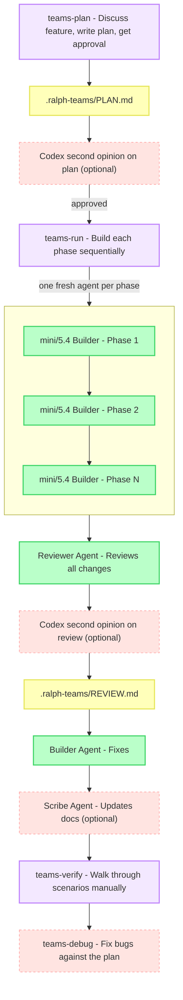

# ralph-teams-codex

A Codex skill pack for planning and building features with sequential builder subagents (gpt-5.4-mini or gpt-5.4 based on phase complexity). Each phase is broken into tasks the builder works through in one session — automated E2E verification, a review pass, and integrated debug and documentation skills.

## Does Codex Support Plugins?

Not in the Claude marketplace sense. Codex is extended through:

- `skills/` with `SKILL.md` metadata and instructions
- `AGENTS.md` for repo-level behavior
- MCP tools such as Playwright and Maestro
- subagents started with `spawn_agent`

This repo packages the original workflow in that Codex-native form.

## Quick Start

```text
teams-plan
```

Describe what you want to build. Codex handles planning, sequential phase execution, review, and verification.

## Install

This repo now includes a Codex installer CLI, following the same basic model as GSD: runtime-specific assets are copied into Codex's config directory.

When published, the intended install flow is:

```bash
npx ralph-teams-codex --global
```

Local install into the current project:

```bash
npx ralph-teams-codex --local
```

Until the package is published, you can run the installer from this repo:

```bash
node bin/ralph-teams-codex.js --global
node bin/ralph-teams-codex.js --local
```

Install only specific skills:

```bash
node bin/ralph-teams-codex.js --global --skills teams-plan,teams-run,teams-verify
```

Uninstall:

```bash
node bin/ralph-teams-codex.js --global --uninstall
node bin/ralph-teams-codex.js --local --uninstall
```

Global installs target `~/.codex/skills` by default, or `$CODEX_HOME/skills` if `CODEX_HOME` is set. Local installs target `./.codex/skills`.

Restart Codex after installing or uninstalling skills.

## How It Works



Each phase runs in its own isolated subagent with a clean 200k token context window. Phases are meaningful feature areas (targeting 50–60% context fill) broken into tasks — the builder completes all tasks within one session. Results are committed after each phase so you can always resume with `teams-run`.

## Skills

| Skill | Description |
|-------|-------------|
| `teams-plan` | Discuss, plan, optionally review the plan, execute phases sequentially, review, then apply fixes if needed |
| `teams-run` | Resume an existing plan from where it left off |
| `teams-verify` | Walk through manual E2E verification scenario by scenario |
| `teams-debug` | Fix a bug in relation to the active plan — usable anytime |
| `teams-document` | Update existing docs (README, ARCHITECTURE.md, etc.) for the latest plan |

## Output

```text
━━━━━━━━━━━━━━━━━━━━━━━━━━━━━━━━━━━━━━━
  RALPH-TEAMS  Plan #3 — 2 of 4 phases complete
━━━━━━━━━━━━━━━━━━━━━━━━━━━━━━━━━━━━━━━
  ✓  Phase 1: Project Setup          [done]        (mini)
  ✓  Phase 2: Auth System            [done]        (5.4)
  ►  Phase 3: API Routes             [building...]  (5.4)
  ○  Phase 4: Frontend               [pending]      (mini)
━━━━━━━━━━━━━━━━━━━━━━━━━━━━━━━━━━━━━━━
```

Status symbols: `✓` done · `►` building · `✗` failed · `○` pending · `(mini)` simple phase · `(5.4)` standard phase

## Output Files

All build artifacts are written to `./.ralph-teams/` in your project:

| File | Contents |
|------|----------|
| `.ralph-teams/PLAN.md` | Plan ID, phases with complexity, acceptance criteria, verification scenarios |
| `.ralph-teams/REVIEW.md` | Reviewer findings |
| `.ralph-teams/VERIFY.md` | Manual verification results |
